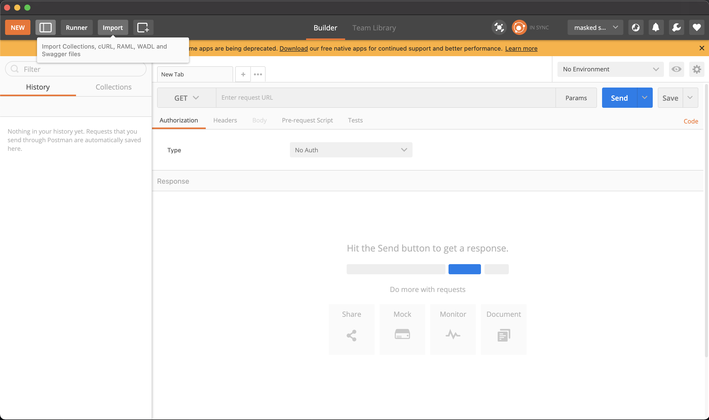
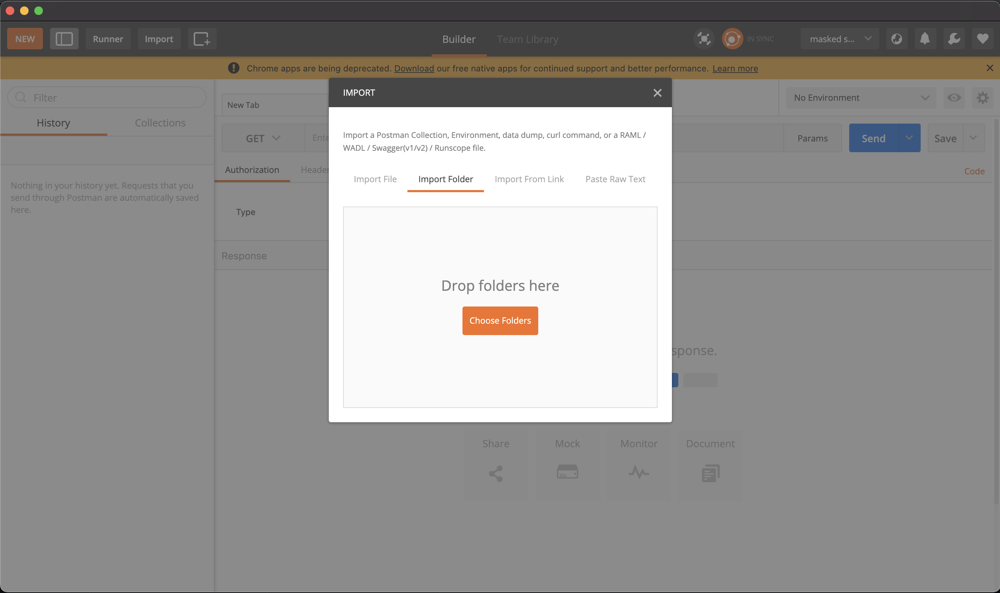
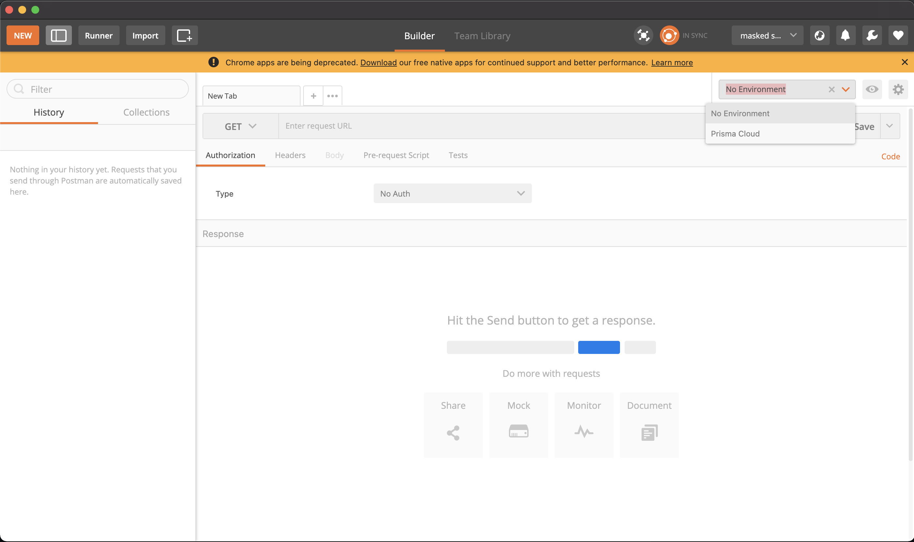

# Instructions on how to setup the Postman Collections and Environments relating to Prisma Cloud (including Compute Console) API requests

To use these Collections and Environment, there are a few setup pieces after importing the 3 files into Postman:
1. [Import the 3 files](https://learning.postman.com/docs/getting-started/importing-and-exporting-data/) in root of this repo (2 Collections and 1 Environment) into Postman.

1. Set the Prisma Cloud API and Console URL in the [Postman Environment variable](https://learning.postman.com/docs/sending-requests/variables/)

1. To get the address/URL for your Console, go to *Compute > Manage > System > Downloads*, and copy the string under **Path to Console**
**The URL should look something like this:** https://us-east1.cloud.twistlock.com/us-1-123456789
   1. You will be replacing the **compute-api-endpoint** variable

1. Depending on what Admin console you see when you log in will determine which API Endpoint you will use. 
   1. The corresponding value below will replace the **api-endpoint** variable.

Prisma Cloud Admin Console | 	Prisma Cloud API Endpoint
------------ | -------------
https://app.prismacloud.io	| https://api.prismacloud.io
https://app2.prismacloud.io	| https://api2.prismacloud.io
https://app3.prismacloud.io	| https://api3.prismacloud.io
https://app4.prismacloud.io	| https://api4.prismacloud.io
https://app.anz.prismacloud.io	| https://api.anz.prismacloud.io
https://app.eu.prismacloud.io	| https://api.eu.prismacloud.io
https://app2.eu.prismacloud.io	| https://api2.eu.prismacloud.io
https://app.gov.prismacloud.io	| https://api.gov.prismacloud.io
https://app.prismacloud.cn	| https://api.prismacloud.cn
https://app.ca.prismacloud.io	| https://api.ca.prismacloud.io
https://app.sg.prismacloud.io	| https://api.sg.prismacloud.io

## The rest of the variables shouldn't need altered, and are either auto-generated or for future or other scenarios.
The below table shows an example of what a completed Environment should look like **before** generating any JWT tokens

Postman Variable | Use | Value/Example
------------ | ------------- | -------------
api-endpoint | Main API endpoint for Prisma Cloud requests | api.prismacloud.io
token	| JWT token auto-generated after the /login request | 
compute-api-endpoint	| API endpoint for all things within the Compute tab | https://us-east1.cloud.twistlock.com/us-1-123456789
compute-token	| JWT token auto-generated after the Compute /authenticate request | 
api-version | Used only for the Compute collection for future API versions | v1
console-port | Used only for self-hosted versions of the Compute Console | 

# Set your access and secret key in the username and password fields in the BODY of the /login and /authenticate requests.
These will be the first 2 requests of both Collections under the **Login** folder. 
* Prisma Cloud API /login BODY example:

`
{ 
    "username": "abcde-fghi-jklm-nopq-rstuvwxyz",   
    "password": "a1b2c3d4e5f6g7h8i9"   
}
`
* There is also an optional parameter to send if you have access to more than 1 Prisma Cloud tenant called *customerName*, example:

`
{ 
    "username": "abcde-fghi-jklm-nopq-rstuvwxyz",   
    "password": "a1b2c3d4e5f6g7h8i9",
    "customerName": "Company XYZ - 123456"
}
`

* Prisma Cloud Compute Console /authenticate BODY example:

`
{ 
    "username": "abcde-fghi-jklm-nopq-rstuvwxyz",   
    "password": "a1b2c3d4e5f6g7h8i9"   
}
`

## Advanced Postman scenarios using Collection Runner

In the **Collection_Runner** folder, there are specific examples for use-cases where using Postman's Collection Runner makes sense. 

This is an easy way to iterate through files/CSVs/etc for a specific subset of API calls you want to make. More instructions in the README within [this folder](https://github.com/PaloAltoNetworks/pcs-postman/tree/main/Collection_Runner).

## That's it! The Collections are not fully complete, so if you find a request that hasn't been created (or needs updated) please feel free to submit a PR. 
